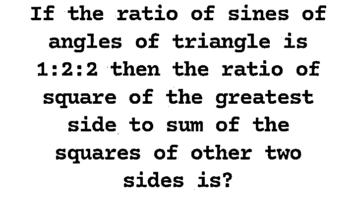
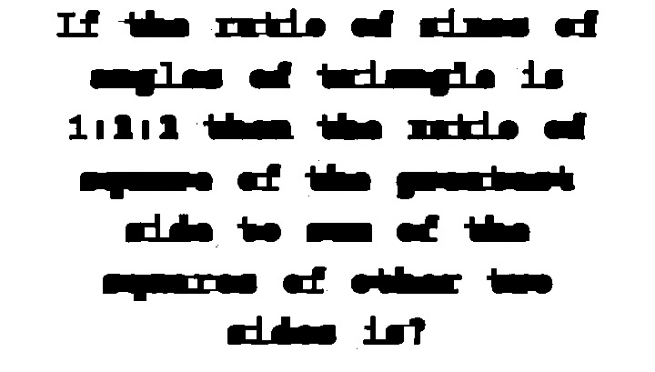
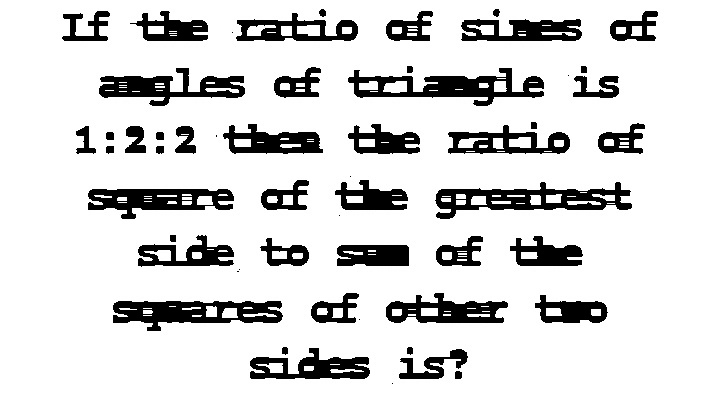
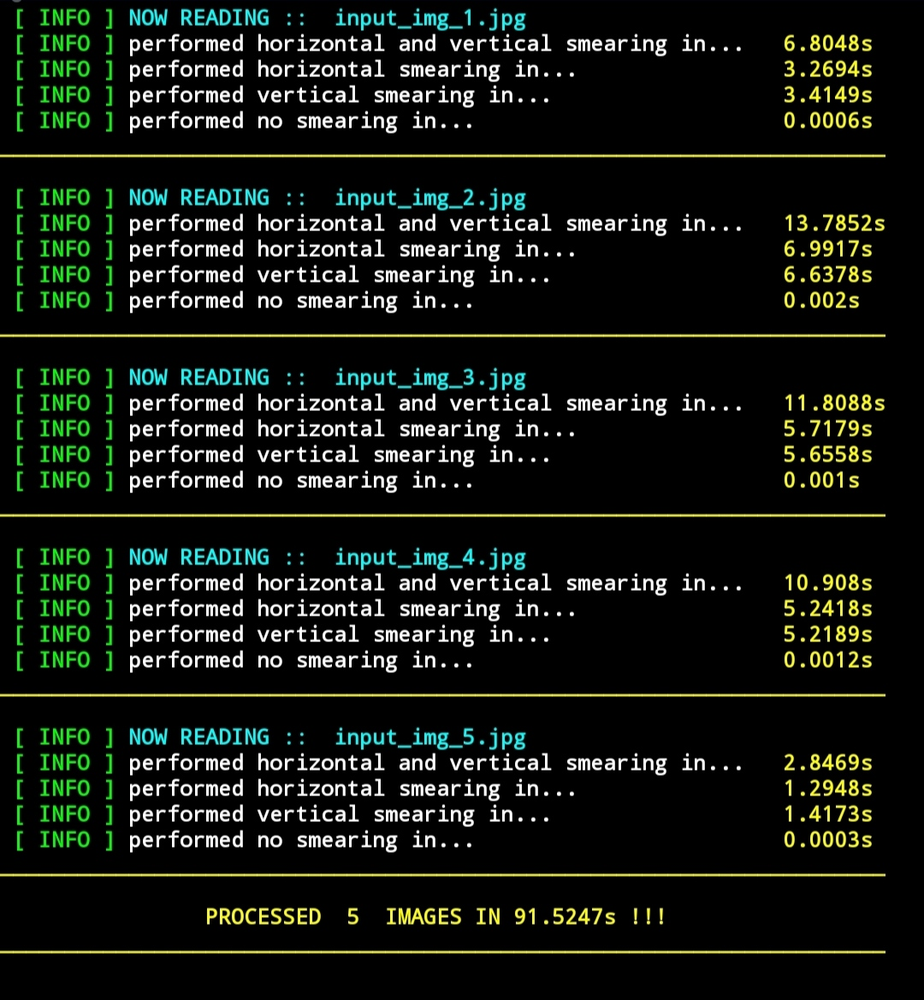
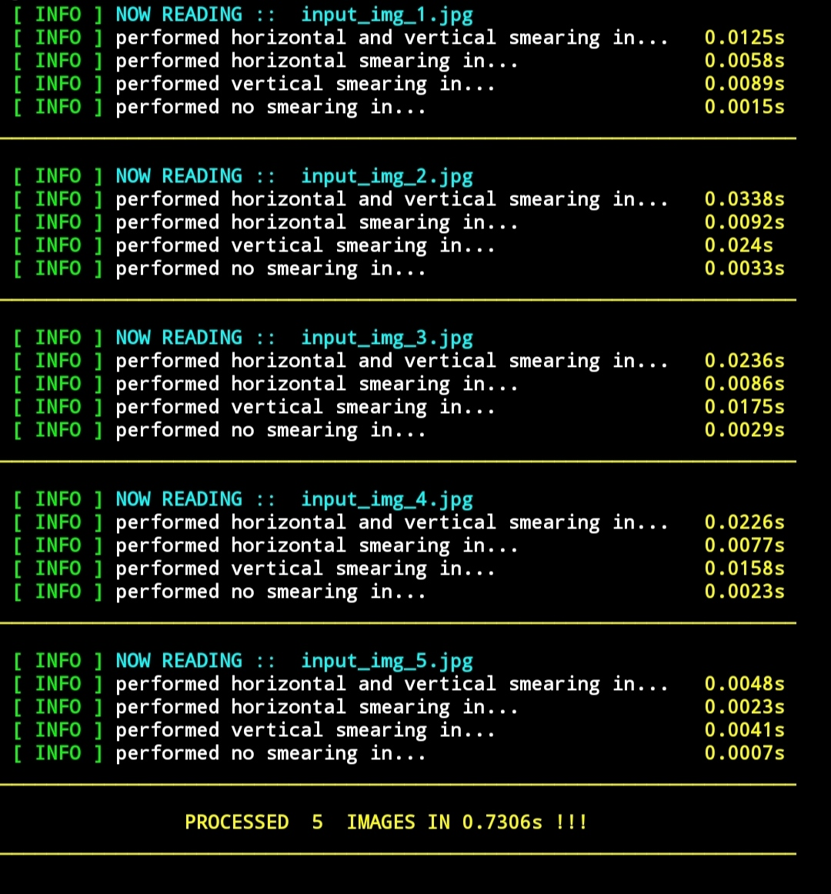

<a href = '#package'>Jump to Package Description</a><br>
<a href = '#project'>Jump to Project Description</a>

# What is Run-Length Smoothing?

- RUN LENGTH SMOOTHING ALGORITHM(RLSA) is a method mainly used for block segmentation and text discrimination.
- It is mainly used in Document Image Processing to extract out the ROI(region of interest) like block-of-text/title/content with applied heuristics.
- Read the application of RLSA here -> [Extract Title from the Image documents in python](https://medium.com/@vasista/extract-title-from-the-image-documents-in-python-application-of-rlsa-58f91237901f)

<a id = 'package'><h1 style = 'font-size: 2.5em'> Package Description</h1></a>

# Latest Updates

	- now rlsa function accepts single value/tuple with pair of values. (before we need to call the function twice)
	- a single value can be assigned to both operations.
	- a tuple pair of values can be assigned to horizontal and vertical operations respectively
    - the package has a module, rlsa_fast, that can perform run-length smoothing in real time.
    - currently, the rlsa_fast function only accepts a single range parameter for both vertical and horizontal smoothing.

# Install

	- pip install pythonRLSA

# Install requirements

	- pip install -r requirements.txt

# Function Calls Snippet - Various Combinations

### For rlsa function
```python
from pythonRLSA import rlsa

rlsa.rlsa(image_binary, True, True, (10,5)) # passing different values for H and V operations
rlsa.rlsa(image_binary, True, True, [10,5]) # passing different values for H and V operations
rlsa.rlsa(image_binary, True, True, (10)) # passing same value but in tuple
rlsa.rlsa(image_binary, True, True, [10]) # passing same value but in list
rlsa.rlsa(image_binary, True, True, 10) # passing same value as int
rlsa.rlsa(image_binary, True, False, 10.0) # passing same value as float
rlsa.rlsa(image_binary, False, True, 10) # passing same value as int for V operation only
```
* H - Horizontal 
* V - Vertical

- Check out the <a href = '#ipython'>IPython code.</a>


### For rlsa_fast function

*Method 1*

```python
from pythonRLSA import rlsa_fast

# Both Horizontal and Vertical smoothing
output = rlsa_fast.rlsa_fast(image_binary, True, True, 10)
# Only Horizontal smoothing
output = rlsa_fast.rlsa_fast(image_binary, True, False, 10)
# Only Vertical smoothing
output = rlsa_fast.rlsa_fast(image_binary, False, True, 10)
```

*Method 2*

```python
from pythonRLSA.rlsa_fast import rlsa_fast

# Both Horizontal and Vertical smoothing
output = rlsa_fast(image_binary, True, True, 10)
# Only Horizontal smoothing
output = rlsa_fast(image_binary, True, False, 10)
# Only Vertical smoothing
output = rlsa_fast(image_binary, False, True, 10)
```

# Input & Output

## Input Image



## Output of 3 cases with value "10" can be seen in the below image

**Horizontal and Vertical Smoothing**



**Horizontal Smoothing**


**Vertical Smoothing**


### [More sample images can be seen here](https://github.com/Vasistareddy/pythonRLSA/tree/master/pythonRLSA/Samples)

# How it works

	- '255'(white pixel) wil be converted to '0'(black pixel) in a image, if the number of adjacent 255's are less than the predefined limit "value".
	- The "value" varies among the different images.

# Sample Test Case

	- value = 3
	- input - [0, 0, 255, 255, 255, 0, 0, 255, 0, 0, 255, 0, 255]
	- output - [0, 0, 255, 255, 255, 0, 0, 0, 0, 0, 0, 0, 255]

# To test

	- python pythonRLSA/test_rlsa_unittest.py -v

# Unittest Results
```
$ test_bool (__main__.TestRLSA) ... ok
$ test_image (__main__.TestRLSA) ... Image must be an numpy ndarray and must be in binary ... ok
$ test_rlsa_hori (__main__.TestRLSA) ... ok
$ test_rlsa_hori_vert (__main__.TestRLSA) ... ok
$ test_rlsa_vert (__main__.TestRLSA) ... ok
$ test_value (__main__.TestRLSA) ... ok
```
----------------------------------------------------------------------
Ran 6 tests in 0.003s

OK

# Prerequisites
	
	- python3.5+
	- Image must be a binary ndarray(255's/1's/0's)
	- Must pass a predefined limit, a certain integer "value"

# Methods

	- rlsa
    - rlsa_fast

# Parameters for rlsa()

	- image - numpy.ndarray(required)
	- horizantal - boolean(required)
	- vertial - boolean(required)
	- value - any positive integer(int)/list/tuple(required)

# Parameters for rlsa_fast()

	- image - numpy.ndarray(required)
	- horizantal - boolean(required)
	- vertial - boolean(required)
	- range - any positive integer(required)
    
*This function does not support keyword arguments yet.*

<a id = 'ipython'></a>
# IPython snippet to convert Image to Binary and RLSA usage
```python

# convert the image to binary
import cv2
image = cv2.imread('test_images/image.jpg')
gray = cv2.cvtColor(image, cv2.COLOR_BGR2GRAY)
(thresh, image_binary) = cv2.threshold(gray, 150, 255, cv2.THRESH_BINARY | cv2.THRESH_OTSU)

# function call
from pythonRLSA import rlsa
image_rlsa_horizontal = rlsa.rlsa(image_binary, True, False, 10)
image_rlsa_horizontal_vertical = rlsa.rlsa(image_binary, True, True, [10,5])

```
# Bugs/Errors

Please ensure that you have updated pip to the latest version before installing pythonRLSA.

If you find any bugs/errors in the usage of above code, please raise an issue through [Github](https://github.com/Vasistareddy/pythonRLSA) or send an email to vasista.1245@gmail.com with a clear example that can reproduce the issue.


<a id = 'project'><h1 style = 'font-size: 2.5em'>Project Description</h1></a>

# Directory Structure

- **pythonRLSA** *(contains the python implementation of Run-Length Smoothing)*
    - **\_\_init\_\_.py** *(initializes the module)*
    - **rlsa.py** *(actual code for RLSA algorithm)*
    - **test_rlsa_unittest.py** *(test, for rlsa and rlsa_fast)*
- **rlsa_fast**
    - **rlsa_c_extension.c** *(code for C Extension for RLSA algorithm)*
- **Samples** *(contains examples showing how to use the module, and some sample outputs)*
    - **input** *(folder containing the input images)*
        -input_img_1.jpg
        -input_img_2.jpg
        -input_img_3.jpg
        -input_img_4.jpg
        -input_img_5.jpg
    - **output** *(folder containing the outputs after applying the algorithm)*
        - **pythonRLSA** *(contains output images produces by python implementations of rlsa)*
            - **horizontal** *(output of horizontal smearing)*
            - **vertical** *(output of vertical smearing)*
            - **both** *(output of both the smearings)*
            - **none** *(output when neighter smearing is applies)*
        - **rlsa_fast** *(contains output images produced by C implementation of rlsa)*
            - **horizontal** *(output of horizontal smearing)*
            - **vertical** *(output of vertical smearing)*
            - **both** *(output when both smearing are applies)*
            - **none***(output when neighter smearing is applied)*
    - **demo_pythonRLSA.py** *(script demonstrating the use of Python implementation of RLSA)*
    - **demo_rlsa_fast.py** *(script demonstrating the use of C implementation of RLSA)*
    
- **Test_Output** *(contains screenshots of results afters running some scripts)*
    - **rlsa_demo.jpg** *(screenshot of terminal after running demo_pythonRLSA.py)*
    - **rlsa_fast_demo.jpg** *(screenshot of terminal after running demo_rlsa_fast.py)*
    - **unittest_result.jpg** *( screenshot of result of unittests for the module)*
- **LICENSE**
- **MANIFEST.in**
- **README.md**
- **requirements.txt**
- **setup.py** *( for installing the package)*

# Use of demo scripts

<p>The Samples folder contains 2 scripts, rlsa_demo and rlsa_fast_demo.
Both these scripts use the rlsa and rlsa_fast function to compute the Run-Length Smoothing of the images.</p>

<p>The output of both are shown below.</p>

<p>To compute the rlsa of an image, refer the code snippets given above, or place the binarized images in the *Samples/input* folder and run either one of the scripts.</p>

<p>The output can be found in the output folder. If you used the *rlsa_demo* script, the output images will be in pythonRLSA folder, otherwise in the rlsa_fast folder.</p>

<p>Both these folders contains 4 subfolders, *horizontal*, *vertical*, *both*, *none*, which store the respective smoothed images.
</p>

# Results of RLSA functions

**Result of Python Implementation**



**Result of C Implementation**



# Installing From Source

1. Download or Clone this repository.
2. Using terminal *cd* to this folder.
3. Run ``` python setup.py build ```.
4. Run ``` python setup.py install ```.
